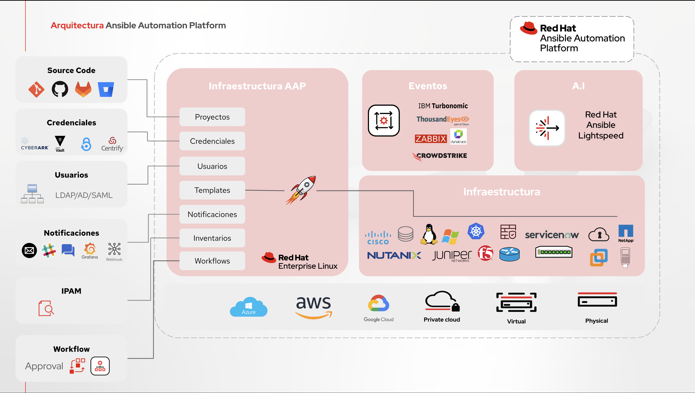
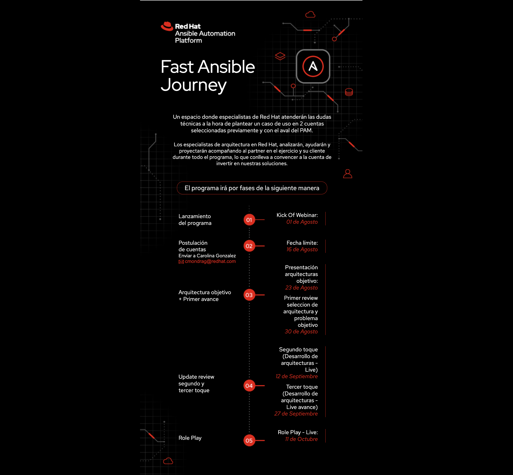

# Fast Ansible Journey



## Alistamiento de la arquitectura

<details close>
<summary>Opción 1. Despliegue de la máquina virtual AAP previamente construida </summary>
<br>
Descargar maquina virtual en formato qcow2 y convertirla para su virtualizador preferido

La imagen lista con el AAP instalado y contenerizado se puede descargar en el siguiente link:
<br><br>
<pre>
<a href="https://www.dropbox.com/scl/fo/369gn1gj3onyfofbxie89/AMX9KU0Zpnv5ndZxhdL08K0?rlkey=o0hka6wp1wfhcsurjgb6cteux&st=olsw8sbd&dl=0" target="_blank">Imagen QCOW2 de AAP</a>
</pre>

Los datos de conexión a la máquina son:
```
root/ABCde123.

aap/ABCde123.
```  

Tenga en cuenta el formato de imagen qcow2 funciona sobre KVM, si usted utiliza otro virtualizador debe convertirla al formato de su virtualizador.

Ejemplo: Busque en google cómo convertir qcow2 a vmdk.

</details>

<details close>
<summary>Opción 2. Desplegar e instalar la máquina virtual AAP desde cero</summary>
<br>
Desplegar la máquina completa y realizar la instalación del Ansible Automation Platform desde cero, para ellos se puede seguir esta guía de implementación de la solución contenerizada todo en uno:
<br><br>
<pre>
<a href="https://developers.redhat.com/articles/2023/11/30/install-containerized-ansible-automation-platform-rhel-92#">Instrucciones Ansible Platform Containerized</a>
</pre>
</details>

<details close>
<summary>Alistamiento Ansible Automation Platform previamente desplegado</summary>
<br>
<h3> Prerrequisitos </h3>

<li>Contar con su maquinas Ansible Automation Platform desplegado sobre su plataforma de virtualización</li>
<li>Contar con un usuario en el portal de <a href="https://developers.redhat.com/register">Developers</a></li>
<li>Contar al menos con una máquina virtual adicional con sistema operativo Red Hat Enterprise Linux 8 o 9</li>
<li>Solicitar suscripción de trial de Ansible Automation Platform
<li>Contar con un usuario y repositorio público o privado en Github para almacenar los playbooks</li>
<li>Suscribir Ansible Automation Platform con el trial <a href="https://XXXX/register">Ver Instrucciones</a></li>
<li>Crear <b>Inventario</b>I de maquinas de Ansible Automation Platform <a href="https://XXXX">Ver Instrucciones</a></li>
<li>Crear <b>Proyecto</b> y enlazarlo con su repositorio de GIT <a href="https://XXXX">Ver Instrucciones</a></li>
<li>Crear <b>Credenciales</b> de máquina dentro de Ansible Automation Platform <a href="https://XXXX">Ver Instrucciones</a></li>
<br><br>

</details>


<h2>RETOS </h2>
<a href="default.asp"></a>


<li>Reto 1 - Parchado de máquinas <a href="RETO1.md">Ver Instrucciones</a></li>

<li>Reto 2 - Aplicar reglas de compliance <a href="RETO2.md">Ver Instrucciones</a></li>


<li>Reto 3 - Instalar y configurar agentes en Windows <a href="RETO2.md">Ver Instrucciones</a></li>

