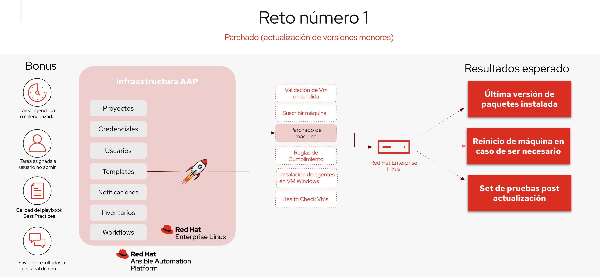

## Reto 2: Aplicar reglas de compliance

**Razón:** Mantener los sistemas actualizados es esencial para asegurar la seguridad y estabilidad de la infraestructura. Las versiones menores a menudo corrigen vulnerabilidades y errores que podrían ser explotados si no se abordan.

**Valor:** La automatización del proceso de parcheo reduce el tiempo de inactividad, minimiza el riesgo de errores humanos, y garantiza que todos los sistemas estén en conformidad con los estándares de seguridad más recientes.

Teniendo en cuenta que el primer reto se trata de realizar el parchado de máquinas Red Hat Linux versiones 8 o 9 a través de un proceso automatizado con Ansible y usando **Ansible Automation Platform**, Este reto debe resolver los siguientes puntos:

- Garantizar la conectividad de el **Ansible Automation Platform** con la máquina cliente RHEL.
- Crear un playbook que se encargue de actualizar los paquetes disponibles para la versión actual (no hacer actualización de versión, solo de paquetes de la versión actual).
- Subir el playbook o los playbooks a un repositorio de git
- Garantizar que el ambiente de **Ansible Automation Platform** se encuentre configurado para poder ejecutar los playbooks (proyectos, credenciales, inventarios, plantillas).
- Ejecutar el playbook para que se ejecute las acciones sobre la máquina virtual RHEL.
- Verificar que posterior a la ejecución, el sistema operativo se encuentre actualizado.

## Bonus:
Tareas adicionales:
- Garantizar que template se ejecute de forma desasistida o programada
- Garantizar que el template puede ser utilizado por un usuario que no sea el admin de **Ansible Automation Platform**.
- Garantizar que el playbook está escrito utilizando las mejores prácticas de Ansible. (ansible-lint)
- Configurar la plataforma para que se conecte con algún sistema de notificación, como por ejemplo slack o correo y se envíe una notificación en caso que la tarea falle.
- Configurar los templates a través de un workflow sencillo, que permita tomar al menos un camino diferente en caso que algunas de las tareas falle

## Resultados esperados para esta prueba

- Se debe evidenciar cual es la versión y release del sistema operativo sobre la que se realizará posteriormente la tarea
- La máquina debe contar con una suscripción de Red Hat válida
- El template debe lanzar la tarea de actualización de los paquetes disponibles para la versión actual. (no actualizar release, solo minor version)
- En caso que la actualización requiera un reinicio de la máquina, el template debe lanzar una tarea de reiniciar el sistema operativo.
- Realizar una prueba básica que evidencie que el Sistema Operativo se encuentre actualizado, disponible y funcionando correctamente.

