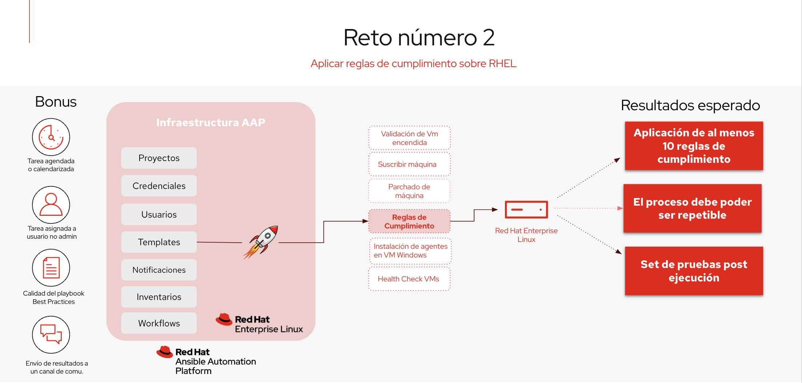

## Reto 2: Aplicar reglas de compliance

**Razón:** Cumplir con las normativas y políticas de seguridad es crítico en entornos empresariales, especialmente en aquellos que manejan información sensible. RHEL ofrece herramientas que le permiten mantener sus máquinas en estado de compliance y a través de **Ansible Automation Platform** aplicarlas de forma masiva a todos sus servidores de forma automatizada.

**Valor:** Implementar la automatización en el cumplimiento normativo asegura que todas las instancias de sus sistemas operativos estén configuradas de manera uniforme, reduciendo la posibilidad de brechas de seguridad y asegurando la adherencia continua a las normativas.

Este segundo reto se trata de crear un proceso automático con Ansible y usando **Ansible Automation Platform**, que permita aplicar normas de cumplimiento básicas, garantizando que sus sistemas operativos mantengan un estado de seguridad mínimo, reduciendo la posibilidad de brechas de seguridad y cumpliendo con las normativas.

Concer más
https://www.redhat.com/en/resources/enterprise-linux-security-compliance-brief

Este reto debe resolver los siguientes puntos:

- Garantizar la conectividad de él **Ansible Automation Platform** con la máquina cliente RHEL.

- Identificar y definir las políticas de seguridad y compliance que deben aplicarse en los sistemas RHEL, tales como reglas de seguridad de contraseñas, configuración de firewalls, auditorías. Seleccione al menos 10 reglas de cumplimiento que desee aplicar a sus sistemas. puede encontrar información en los siguientes links
    * https://docs.redhat.com/en/documentation/red_hat_enterprise_linux/9/pdf/security_hardening/Red_Hat_Enterprise_Linux-9-Security_hardening-en-US.pdf

    * https://static.open-scap.org/ssg-guides/ssg-rhel8-guide-pci-dss.html
- Crear uno o múltiples playbooks que se encargue aplicar las *10* políticas de seguridad y compliance definidas en el punto anterior.
- Subir el playbook o los playbooks a un repositorio de git
- Garantizar que el ambiente de **Ansible Automation Platform** se encuentre configurado para poder ejecutar los playbooks (proyectos, credenciales, inventarios, plantillas).
- Ejecutar el playbook o los playbooks para que se ejecute las acciones sobre la máquina virtual RHEL.
- Verificar que posterior a la ejecución, el sistema operativo aplicar las políticas de seguridad y compliance definidas previamente
- Puede utilizar **Red Hat Insights** o los comandos de `oscap` para verificar si los cambios fueron aplicados.
    * https://docs.redhat.com/en/documentation/red_hat_enterprise_linux/8/html/system_design_guide/scanning_the_system_for_security_compliance_and_vulnerabilities#vulnerability-scanning_system-design-guide

## Bonus:
Tareas adicionales:
- Garantizar que template se ejecute de forma desasistida o programada
- Garantizar que el template puede ser utilizado por un usuario que no sea el admin de **Ansible Automation Platform**.
- Garantizar que el playbook está escrito utilizando las mejores prácticas de Ansible. (ansible-lint)
- Configurar la plataforma para que se conecte con algún sistema de notificación, como por ejemplo slack o correo y se envíe una notificación en caso que la tarea falle.
- En caso de realizar algún cambio en archivo, realizar un backup previo del archivo
- Teniendo en cuenta que **Red Hat Insights** cuenta con la posibilidad de integrarse con **Ansible Automation Platform**, utilizar esta integración facilita muchas de las tareas que se deben realizar previas.

## Resultados esperados para esta prueba

- Se debe evidenciar la aplicación de por lo menos las 10 reglas de cumplimiento fueron aplicadas
- El proceso debe ser repetible, ya que mantener un sistema en cumplimiento no es un proceso que se ejecuta una única vez, mas bien debe ser un proceso continuo
- Debe contar con un set de pruebas, que permita validar que las reglas se encuentran aplicadas en este momento y que basado en esas 10 pruebas, la máquina está en cumplimiento
- En caso que la actualización requiera un reinicio de la máquina, el template debe lanzar una tarea de reiniciar el sistema operativo.
